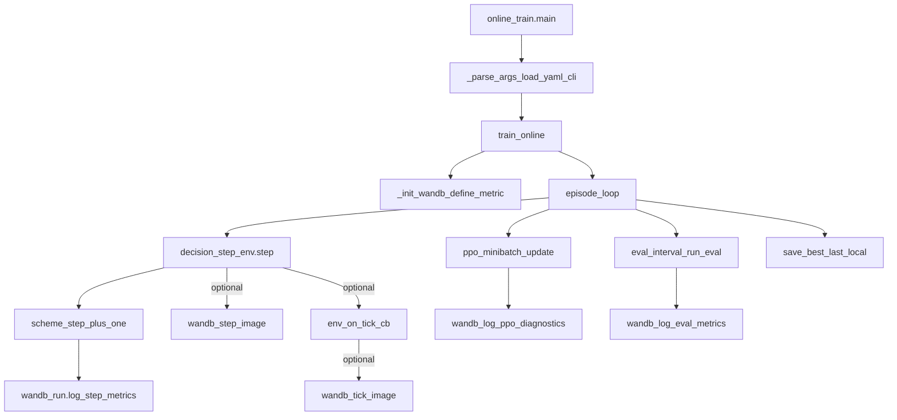

## 目标与约束
- **横轴**：奖励/训练曲线的 x 轴按“决策步（decision step）”而非物理时间；并且你选择了 **per-scheme 计步**（各 scheme 各自单调递增）。
- **可视化开关**：你选择对 **`step_image`** 与 **`tick_image`** 分别加独立开关。
- **模型保存**：继续 **只保存到本地**（`output/checkpoints/*.pt`），明确不做 `wandb.Artifact` / `wandb.save`。
- **图像选择**：对齐优秀 PPO/MAPPO 仓库常见面板（参考 CleanRL 的 PPO 指标集合：`policy_loss/value_loss/entropy/approx_kl/clipfrac/explained_variance/learning_rate/SPS` 等；以及常见 MARL 指标如 win-rate / episode_return / episode_length）。

## 现状定位（关键文件与现有实现）
- 训练与 W&B 日志集中在 [`marl/runners/online_train.py`](/home/xujunyi/Dubins_Intercept/marl/runners/online_train.py)：
  - `_init_wandb()` 定义指标与 x 轴（当前 step 轴是 `global_step`，且所有 scheme 共享累加）
  - 主训练 while 内 `run.log(...)` 上报 step-level reward 分解、时间/重规划等
  - `_on_tick_cb()` 回调里上报 tick-level 图片
  - `_wandb_log_video()` 上报视频（本次不改视频开关，除非后续扩展）
- PPO 更新在 [`marl/rl/mappo.py`](/home/xujunyi/Dubins_Intercept/marl/rl/mappo.py)：目前只返回 `policy_loss/value_loss/entropy`，尚未计算 `approx_kl/clipfrac/explained_variance/grad_norm` 等诊断指标。
- 配置入口在 [`configs/train_online0324.yaml`](/home/xujunyi/Dubins_Intercept/configs/train_online0324.yaml)：已有 `step_frame_interval`、`wandb_tick_image_every` 等频率项。

## 设计：把横轴改为 per-scheme 决策步
- 在 `train_online()` 内为每个 scheme 维护独立计数器：`scheme_step[scheme_name]`（每次外层 `env.step(action)` 后 +1）。
- 所有 step-level 的 `run.log` 都带上 `{"<scheme>/scheme_step": scheme_step[scheme]}`（以及可选保留现有 `global_step` 作为调试/总体吞吐指标）。
- 在 `_init_wandb()` 里把该 scheme 下的 step-level metric 的 `step_metric` 从 `global_step` 改为 **`<scheme>/scheme_step`**，避免多 scheme 交错导致曲线 x 轴跳动。

## 设计：新增“图片上传”独立开关
- 在 `TrainConfig` 增加两个布尔字段（并在 argparse + YAML 支持）：
  - `wandb_log_step_images: bool`：控制 `{scheme}/step_image`
  - `wandb_log_tick_images: bool`：控制 `{scheme}/tick_image`
- 逻辑改动点：
  - `step_image` 的 `if run is not None and cfg.step_frame_interval ...` 额外加 `and cfg.wandb_log_step_images`
  - tick 回调的 `if run is not None and tick_every > 0 ...` 额外加 `and cfg.wandb_log_tick_images`
- `need_train_rgb` 的推导也要考虑开关（避免仅因开关关闭却仍强制开 `rgb_array` 导致开销）。

## 设计：参考优秀 PPO/MAPPO 的“训练图像/曲线集合”，挑选你项目最有价值的上传信息
### A. 性能/任务指标（最重要）
- `episode_return`（已有）
- `eval_return` / `best_eval_return`（已有）
- `episode_steps`、`eval_steps`（已有）
- 你的任务特有：
  - `{scheme}/episode_asset_breach_count`（已有）
  - `{scheme}/replanned_ratio`、`{scheme}/decision_step`（已有）

### B. 奖励分解（用于诊断 credit 与 shaping）
- `{scheme}/r_qual`, `{scheme}/r_global`, `{scheme}/r_safe`, `{scheme}/r_time`, `{scheme}/terminal_bonus`, `{scheme}/terminal_penalty`（已有）
- 这些都统一用 per-scheme 决策步作为横轴（scheme_step）。

### C. PPO 训练诊断（对齐 CleanRL/常见 PPO 面板）
在 [`marl/rl/mappo.py`](/home/xujunyi/Dubins_Intercept/marl/rl/mappo.py) 的 `ppo_minibatch_update` 中补齐并返回（或用 dict 返回）以下指标：
- **`approx_kl`**：用 `logratio = new_logp - old_logp`，按 CleanRL 常用估计 `((logratio.exp() - 1) - logratio).mean()`
- **`clipfrac`**：`(abs(ratio-1) > clip_range).mean()`（或等价判据）
- **`explained_variance`**：用 rollout 的 `returns` 与 `values`（episode 级/更新级均可），`1 - Var(y - yhat)/Var(y)`
- **`grad_norm`**：`clip_grad_norm_` 返回值即可
这样训练脚本可在 episode 结束或每次 update 后 `run.log({"<scheme>/approx_kl":..., ...})`。

### D. 图片（你选择继续上传，但要可控）
- `{scheme}/step_image`：用于观察宏观态势（较稀疏）
- `{scheme}/tick_image`：用于观察物理推进细节（非常密，默认建议关闭或大步长采样）

## 验证方式（不改动业务逻辑前提下确认可视化正确）
- 本地运行一个短训练（少 episodes、低频率图片）确认：
  - 每个 scheme 的 `scheme_step` 单调递增且从 1 开始
  - W&B UI 中 step-level 指标的 x-axis 使用 `<scheme>/scheme_step`
  - 关闭 `wandb_log_tick_images` 时不再出现 `{scheme}/tick_image` 且不会触发 tick render
  - 模型 checkpoint 仍只落在 `output/checkpoints/`，W&B 中无 artifacts/文件上传

## 日志流（概念图）

