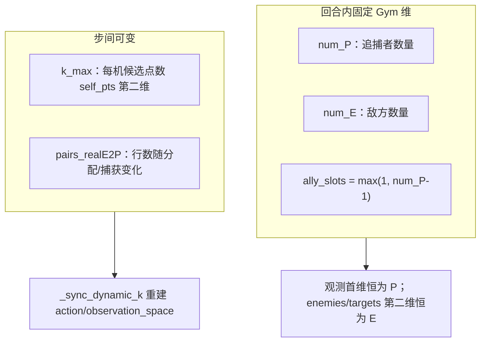

# MARL 项目风险与动态尺寸适配（含 smash / catch 语义对照）

## 1. 尺寸分层：什么是固定的、什么是动态的




### 1.1 `max_k` 是什么（精确定义）

在 `[obs_generator._build_c_nodes](marl/obs_generator.py)` 中：

1. 对 `pairs_realE2P` 的 **每一行** `(eid, pid)`，在 `ic_candidates`（即当前 `ICFinalActionCandidates`）里筛出 `eid_ref==eid` 且 `pid_ref==pid` 的所有拦截候选行，得到该 **(E,P) 对** 的一个子集 `subset`。
2. `**max_k`** = 所有 `(eid,pid)` 对中，`subset` **行数** 的最大值（若配置了 `candidate_limit` 再与之上限取 min），并 **至少为 1**。
3. 用该 `max_k` 分配 `nodes/reward_nodes/mask` 的形状为 `(num_p, max_k, 8)` 与 `(num_p, max_k)`：同一决策步内，所有追捕者共享 **同一** 第二维长度，以便 batch 进网络；某一对真实候选少于 `max_k` 时，右侧槽位为 **padding**，由 `self_pts_mask` 标为无效。

因此：`**max_k` 不是「每机不同」的列表，而是本步全局统一的候选槽宽度**；物理含义是「当前匈牙利给出的各 (E,P) 子集中，候选条数的上界（加裁剪）」。

---

- **固定**：`[TODCMARLEnv](marl/MARL_env.py)` 在加载地图后设定 `num_P`、`num_E`；`observation_space` 中 `enemies`/`targets` 为 `(num_P, num_E, ·)`，**不随捕获缩小**。
- **动态**：`self_pts`/`self_pts_mask` 的第二维 **K**（实现里即 `max_k`，环境属性里 `k_max`）由上一节定义；`[_sync_dynamic_k](marl/MARL_env.py)` 在 `reset`/`step` 后根据当前观测更新 `k_max` 与 `MultiDiscrete`。

结论：**网络与 Gym 张量形状在 P/E 维上是「开局定死」的**；算法主要处理 **K 变化**（pointer 维），而不是「少一架机就少一维」。

---

## 2. `pairs_realE2P` 与捕获：与 `Capflag` 对齐的隐含假设

### 2.1 语义：行是 **(eid, pid)** 分配对，不是「按 pursuer 行下标」排序

- `pairs_realE2P` 为 **N×2**，每行一条当前分配：**第 0 列为 evader id，第 1 列为 pursuer id**（映射到全局 `UnCapEid` / `UnCapPid` 后的整数 id，见 `[MARL_env._apply_hungarian_and_paths](marl/MARL_env.py)` 与 `[main0319forRL.py](main/main0319forRL.py)` 520–521 行附近）。
- 匈牙利结果 **不要求是「对角」**：例如两对敌机时完全可以是  
`[[0, 2], [1, 0]]`  
表示 e0→p2、e1→p0。捕获一对后，行数与内容会随 `Capflag` 与重规划变化，**仍应保持「每行一个 (eid,pid)」的语义**，而不是「第 i 行必等于 pursuer i」。

### 2.2 与 `main0319forRL.py` 相同的 `_phase_update` 门控

`[_phase_update](marl/MARL_env.py)`（对齐 `[main0319forRL.py](main/main0319forRL.py)` 约 217–223 行）核心逻辑为：

```python
if pairs_realE2P is not None and pairs_realE2P.shape[0] == self.Capflag.shape[0]:
    self.UnCapPidNew = self.pairs_realE2P[~self.Capflag, 1].astype(int)
    self.UnCapEidNew = self.pairs_realE2P[~self.Capflag, 0].astype(int)
    self.pairs_realE2P = self.pairs_realE2P[~self.Capflag]
```

**风险**：

1. **长度门控**：仅当 `len(pairs_realE2P) == len(Capflag) == num_E` 时才进入。一次过滤后 `pairs_realE2P` 行数减少，**后续时间步该条件恒为假**，`UnCapPidNew` 不再经此路径与 `Capflag` 同步；是否仍正确依赖其它路径（例如每次重规划是否重建与 `num_E` 对齐的 `pairs`）——**需要在「多段捕获、中间不重规划」场景下用运行或单测验证**，否则存在 **pairs 与当前捕获状态脱节** 的理论风险。
2. **文档已提示**：`[docs/MARL_OVERVIEW.md](docs/MARL_OVERVIEW.md)` 6.7 节：`pairs_realE2P is None` 时观测生成会直接失败；自定义 reset/跳过规划时尤需注意。
3. **与参考脚本一致的不变量**：`main0319forRL.py` 同样要求 `pairs_realE2P.shape[0] == Capflag.shape[0]` 才进入更新块；因此「与 `Capflag` 等长、且行下标与敌机下标可对齐」的表结构是参考实现隐含假设。一次 `pairs_realE2P[~Capflag]` 后行数变少，**除非重规划再次把 `pairs` 恢复为与 `Capflag` 等长的规范形式**，否则后续 `_phase_update` 可能长期跳过该分支——与 MARL 侧行为一致，需在 **多段捕获、中间是否重规划** 下用仿真或**大量参数化测试**验证 `UnCapPidNew`/`pairs` 是否与几何一致。

### 2.3 建议的「大量测试」验证点（针对 `(eid,pid)` 与 `self_pts[pid]`）

在固定 `IC` 子集上构造或录制：使 `pairs_realE2P` 为 **非对角**（如 `[[0,2],[1,0]]`）。对 **每个** `pid`，断言：

- `self_pts[pid, :, :]` 中 **mask 为真的行**，与 `ICFinalActionCandidates` 中 `eid_ref`、`pid_ref` 与该 `pid` 及其行内 `eid` 一致的候选集合 **一致**（或同构排序后一致）。

若当前实现用 `subsets` 的**列表行号**冒充 **pursuer 下标 `pid`**，而非 `pid → subset` 映射，则在此类分配下易把 **第 k 个 (eid,pid) 对的子集** 错填到 **pursuer k** 行——上述测试可 **直接检出** 该类错误。

---

## 3. 观测与决策：全维张量 + 掩码不完整


| 对象   | 张量形状                                | 捕获后是否显式剔除                                                                                                                                  |
| ---- | ----------------------------------- | ------------------------------------------------------------------------------------------------------------------------------------------ |
| 全体敌方 | `(P, E, 3)` / `(P, E, 2)`           | `[obs_generator](marl/obs_generator.py)` 中 `enemy_mask`、`target_mask` **默认全 True**（见 `enemy_mask = np.ones(...)`），**未按 `Capflag` 屏蔽已捕获敌机** |
| 分配敌  | `enemy_assigned_*`、`asset_target_*` | 由 `[_eid_for_each_pid](marl/obs_generator.py)` 从 `pairs_realE2P` 填；无分配时为 **-1 / mask False**                                               |
| 候选点  | `self_pts` + `self_pts_mask`        | 由 `_build_c_nodes` 按 `(eid,pid)` 对填 **每架 P 的行**；无候选则该行 mask 全 0                                                                            |


**风险**：

- **已捕获敌方仍进入 `enemies`/`targets`**：策略若未学会忽略，易产生干扰；**不属于**你定义的「敌方不再参与模型输入」。
- **无分配/无候选的追捕者**：`[_normalize_action](marl/MARL_env.py)` 在 `self_pts_mask` 全零时会 `**ValueError`**（「no valid action candidates」）。多机多于敌、或部分机「闲置」时，**训练/评估会直接崩**，除非你保证每步重规划后每人至少一条合法候选。

---

## 4. `_build_c_nodes`：必须用 **pid** 索引子集，不能用 **pairs 行号** 冒充 **pid**

当前实现大致为：先 `for (eid, pid) in pairs_realE2P: subsets.append(...)`，再 `for pid in range(num_p): subset = subsets[pid]`。

- **正确语义**：对每个 **pursuer `pid`**，应取 **属于该 `pid` 的那条 (eid,pid)** 在 `ic_candidates` 中的子集，写入 `nodes[pid]`。
- **风险**：`subsets` 的列表顺序等于 `**pairs_realE2P` 的行顺序**（常按 eid 或匈牙利输出顺序），**一般不等于 `0..num_P-1` 的 pursuer 顺序**。若用 `subsets[pid]` 当「第 pid 个 pursuer」的子集，在非对角分配（如 `[[0,2],[1,0]]`）时会把 **e0 的子集错写到 p0 行**（应写到 p2 行）。
- **越界**：若 `len(pairs) < num_P`（闲置机），`subsets[pid]` 可能 **IndexError**；闲置机行的候选与 mask 需单独约定（全 0 + 与 `_normalize_action` 一致）。

**结论**：与第 2.3 节属性测试配套——**通过大量随机/参数化匈牙利结果 + 非对角 pairs** 验证；若失败，应改为 `**pid -> subset`**（或对每个 `pid` 在 `pairs` 中查找其 `(eid,pid)` 行再取子集）。

---

## 5. 你定义的两种模式 vs 当前实现


| 模式        | 你的期望                              | 当前代码倾向                                                                                                                                                                                    |
| --------- | --------------------------------- | ----------------------------------------------------------------------------------------------------------------------------------------------------------------------------------------- |
| **Smash** | 拦截成功后，对应 **我方 + 敌方** 都不再参与模型输入与决策 | **未实现**：`num_P`/`num_E` 固定；`enemies` 仍含已捕获 E；策略仍输出 `num_P` 维动作；仅 `[_apply_assignment_from_action](marl/MARL_env.py)` 对 `**UnCapPidNew`** 中的 P 应用路径（局部类似「未分配则不更新路径」），**不等于**从策略输入/输出中移除该机。 |
| **Catch** | 敌方不再参与；**我方仍参与**                  | **部分重叠**：无分配时 `enemy_self_mask` 等可为 False；但 **全局 `enemies[:, eid]` 仍存在**；我方始终占用一行观测与离散动作维。                                                                                                |


若要严格实现两种模式，通常需要 **额外设计**（二选一或组合）：

- **显式 agent 掩码**：例如 `p_active`、`e_active`，网络前向与损失中对无效维 mask（或从 batch 中剔除）。
- **或** 改变任务表述：回合在首次成功后拆分/终止，使不存在「已退出仍占维」的情况。

当前仓库 **没有** 名为 `smash`/`catch` 的配置开关；上述仅为语义对照。

---

## 6. 奖励与 `k`（`max_k`）的关系 + 与 `main0319forRL.py` 的对照

### 6.1 「奖励应与 k 无关」指什么

在 `[marl/rewards.py](marl/rewards.py)` 的 `compute_step_rewards` 中：

- **步级质量项 `r_qual`**：对每机用 **所选候选行** `reward_nodes[i, selected_idx[i], :]` 的 8 维特征（`dist_v`, `delta_t`, …）做线性组合。这些量来自 **IsoMap/任务表对该拦截方案的几何与代价解释**，是 **物理量**，**没有**「乘以 `1/max_k`」或「候选越多奖越大」这类 **显式依赖槽宽 K 的公式**。
- **全局项 / 安全项**：用选中点的平面坐标与机间几何，同样 **不把 `K` 放进公式系数**。
- `**k` 实际参与之处**：仅 **(1)** 张量第二维宽度与 **(2)** `selected_idx` 在 `[0, K)` 内合法且过 `self_pts_mask`。**同一拦截方案** 在特征不变的前提下，**不因右侧 padding 变长而改变其 8 维数值**；padding 只是无效槽。

因此：**奖励定义（对「选中候选」的函数）与 `max_k` 无直接关系**；但 **若两步之间 `max_k` 或候选排序变化**，同一 **物理** 拦截可能在张量里 **换槽位下标**，策略若按索引记忆会出现 **非平稳**——这是 **决策接口** 问题，不是 `r_qual` 公式里多了一项 K。

### 6.2 计奖时刻与 `main0319` 一致

- 环境在 `step` 内用 **选动作时刻** 的观测快照计奖（避免内层重规划后 K 与 mask 与动作错位）。
- `r_time` 中 `step_cost * (sim_time_elapsed / sim_dt)` 与 `[rewards.py](marl/rewards.py)` 注释「与 main0319 中 t/t_all 一致」对齐参考脚本的时间尺度。

### 6.3 `marl/MARL_env.py` 与 `main0319forRL.py` 内部阶段对照（实现应参照参考脚本）


| MARL 环境方法 / 阶段                    | `main0319forRL.py` 注释锚点（约）                                                               | 说明                                                                                       |
| --------------------------------- | ---------------------------------------------------------------------------------------- | ---------------------------------------------------------------------------------------- |
| `_phase_update`                   | 211–223，`# RL: _phase_update`                                                            | `t`/`t_all` 递增；`pairs_realE2P` 与 `Capflag` 同长时更新 `UnCapPidNew`/`UnCapEidNew` 并收缩 `pairs` |
| `_advance_from_paths`（及几何推进）      | 230–260，`# RL: _advance_from_paths//_phase_geometry_step`                                | 由 `PathP`/`PathE` 取 `PosP`/`PosE`，更新 `PathPtrue` 等                                       |
| `_phase_check_decision`           | 262–274 起                                                                                | 碰撞/资产/DWA；`need_replan` 与 `terminal`                                                     |
| `_replan_with_isomap` / 候选与匈牙利    | 274–521，`# RL: _compute_isomap_intercept_candidates` 至 `# RL:_apply_hungarian_and_paths` | 轨迹预测、`IC`、`unique_pairs` 最佳行、`linear_sum_assignment`、`pairs_realE2P` 映射                  |
| `_apply_paths_from_assigned_rows` | 541+，`# RL: _apply_paths_from_assigned_rows`                                             | 由选定行更新 `PathE`/`PathP`                                                                   |


**注意**：参考脚本在重规划分支里还有 `refine_icfinal_with_model`；MARL 用 `_apply_assignment_from_action` 把 **策略选的候选行** 接到路径上。**环境动力学与时间表** 仍应以 `[main0319forRL.py](main/main0319forRL.py)` 同一套几何更新为准，差异主要在 **谁选 `IC` 中的哪一行**。

### 6.4 其它工程风险（简要）

- **动态 K 与严格 Gym 检查**：`[docs/MARL_OVERVIEW.md](docs/MARL_OVERVIEW.md)` 6.6：`k_max` 变化会重建空间；第三方库若假设固定空间可能失败。
- **重规划仍遍历全 E×P**：`[_replan_with_isomap](marl/MARL_env.py)` 中 `meshgrid(np.arange(self.num_E), ...)` **未显式跳过已捕获 E**（需确认下层 `obtainPTP2TP_*` / `CapRef` 是否内部屏蔽已捕获目标），存在 **无效计算或语义混杂** 的风险。

---

## 7. 建议的后续动作（若你要落地 smash/catch）

1. **写清规格**：每种模式下「不参与」是指 **张量置零+mask**、还是 **从计算图中移除**、回合是否立即结束。
2. **加针对性测试**：多步决策、部分捕获、`num_P != num_E`、**非对角 `pairs_realE2P`（如 `[[0,2],[1,0]]`）** 下 `self_pts[pid]` 与 `IC` 子集一致性（第 2.3 / 4 节）。
3. **审计 `_build_c_nodes`**：改为按 **pid**（及对应 **eid**）取子集；并核对 `**_phase_update` 与重规划** 是否恢复 `len(pairs)==len(Capflag)` 的不变量（与 `[main0319forRL.py](main/main0319forRL.py)` 一致）。

本计划为**风险阅读、语义与参考脚本对照**；代码修改需在 Agent 模式下执行。