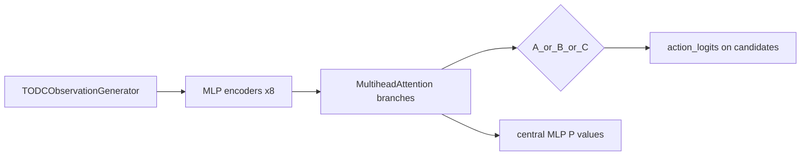

# MARL 模型设计说明

## 1. 总体角色

- **算法**：多智能体 PPO（MAPPO），价值与策略更新见 `[marl/mappo.py](marl/mappo.py)`：`ppo_minibatch_update` 对每步调用 `actor_forward`（分类分布）与 `critic_forward`（每 pursuer 一个标量价值）。
- **封装**：`[TODCHeteroActorCritic](marl/models.py)` 仅为 `UAVInterceptionNetwork` 的薄包装，暴露 `actor_forward` / `critic_forward` / `forward`（actor + value）。
- **训练入口**：`[marl/train_online0325.py](marl/train_online0325.py)` 通过 `build_actor_critic_schemes(cfg.schemes, hidden_dim, num_heads, device)` 可同时实例化多种方案（键为可读名称如 `"Concatenative Query Network"`），便于并行对比实验。

## 2. 观测与网络输入对齐

`[TODCObservationGenerator._build_model_aligned_obs](marl/obs_generator.py)` 构造与 `UAVInterceptionNetwork._encode_obs` 一致的 dict，首维为 pursuer 数 `P`。策略网络实际使用的核心键包括：

| 键                  | 形状含义                  | 编码器                         |
| ------------------ | --------------------- | --------------------------- |
| `self_uav`         | `[P,1,3]` 自身 x,y,θ    | `enc_self`: 3→H             |
| `allies_local`     | `[P,A,3]` 友机          | `enc_ally`                  |
| `self_pts`         | `[P,K,8]` 自身候选拦截点特征   | `enc_self_pts`              |
| `ally_pts`         | `[P,·,8]` 友机候选拼接      | `enc_ally_pts`              |
| `enemy_assigned_`* | 分配敌机位姿                | `enc_enemy`                 |
| `asset_target_`*   | 分配敌对应攻击目标 (x,y)       | `enc_asset`                 |
| 各类 `*_mask`        | 变长序列 padding / 无效候选屏蔽 | 传入 MHA 的 `key_padding_mask` |

动作空间：**在自身 `K` 个候选点中选一项**（离散），`self_pts_mask` 将无效位置 logits 置为 `-1e9` 后 softmax。

## 3. 网络骨干：八路上下文 + MultiheadAttention

`[UAVInterceptionNetwork](marl/models.py)` 将异构信息分为 **8 路**（`N_BRANCHES = 8`），每路先 MLP 编码到 `hidden_dim`，再用 **以自身 embedding 为 query** 的 `nn.MultiheadAttention` 聚合序列信息（友机、候选点、分配敌、资产目标等），与 docstring 中「八路上下文」一致。

## 4. 三种设计模式（A / B / C）

解析逻辑：`resolve_design_mode`（`[marl/models.py](marl/models.py)`），别名含 `cqn`/`gqn`/`pwsn` 等。

- **A — Concatenative Query Network**  
八路聚合向量 **拼接** 为 `8*H`，经 `fusion_mlp` 得到环境向量 `h_env`。  
**动作 logits**：scaled dot-product——`q_opt(h_env)` 与 `k_opt(各候选点编码)` 逐候选相似度（除以 `sqrt(H)`），与 attention 中常见缩放一致。
- **B — Gated Query Network（软门控）**  
对除 `e_self` 外的 7 路，用 `[e_self; h_branch]` 过线性门 + LeakyReLU 得标量分数，7 路 softmax 得权重，**加权求和**到 `e_self` 得 `h_env`。  
候选 logits 计算方式与 **A 相同**（`q_opt` / `k_opt`）。
- **C — Point-Wise Scoring Network**  
Query 改为 **候选点序列** `e_self_pts`：每路 MHA 的 query 为 `e_self_pts`，对每条候选拼接八路输出，经 `scoring_mlp` **直接输出每候选一个标量分数**（无 `q_opt`/`k_opt` 的 global query）。

## 5. Critic：集中式、联合状态

`[critic_forward](marl/models.py)` 将 **所有 pursuer** 的八路特征拼成联合向量（展平维度 `P * 8 * H`），经惰性创建的 MLP（`_ensure_critic`）输出 **长度为 P 的价值向量**。  

- A/B：每 agent 分支特征为拼接的 8×H。  
- C：对沿候选维度的张量用 mask 做 **加权平均池化** 再拼接，得到每 agent 定长向量。

这与 MAPPO「集中训练、分散执行」一致：critic 见全局联合特征，actor 仍只依赖各 agent 局部观测 dict（实现上同一 forward 内用整批 `obs`）。

## 6. 数据流（简图）

## 7. 与仓库其它部分的关系

- 环境 `[TODCMARLEnv](marl/MARL_env.py)` 驱动仿真并调用观测生成；**模型文件不直接依赖环境类**，仅依赖观测 dict 契约。
- 测试 `[tests/test_phase3_models.py](tests/test_phase3_models.py)` 覆盖三方案别名、`forward` 形状与 mask 行为。

---

**结论**：模型是 **异构 8 分支注意力 + 三种融合/打分方式** 的离散策略网络，配合 **联合状态 MLP critic**；设计核心在 A（拼接）、B（软门控融合）、C（逐候选打分）三者对同一观测骨干的差异。