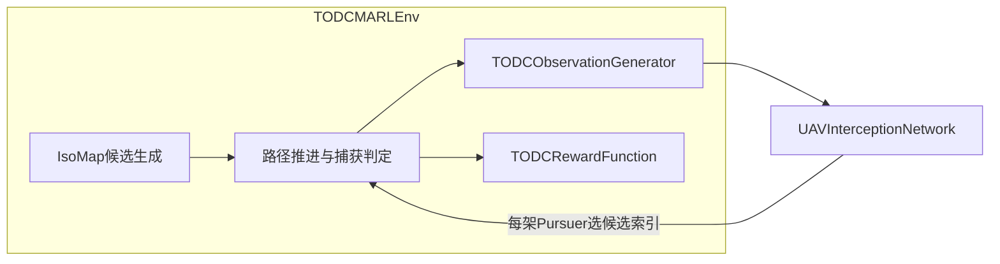

# Dubins_Intercept：MARL 视角解读与潜在问题

## 1. 项目在 MARL 里「解决什么问题」

- **任务**：多架 Pursuer 在障碍地图中拦截多架 Evader；底层是 Dubins / IsoMap 与任务分配等**传统规划管线**（与 `main/main0319forRL.py` 同源思路）。
- **RL 扮演的角色**：不输出连续 `(v, ω)`，而是在每次**重规划**得到的离散**拦截候选点/方案**中为每个 Pursuer **选一个索引**（pointer / scoring）。
- **时间语义**：默认 `step_mode: decision` 时，一次 `env.step` = 一次「在线决策步」：先应用动作，再内层循环推进仿真直到**需要重规划**、**终止**或**截断**（见 `[marl/MARL_env.py](marl/MARL_env.py)` 中 `step` 与注释）。

## 2. 智能体、参数共享与「是否 CTDE」

- **智能体**：`num_P` 个 Pursuer；Evader 由轨迹与规则驱动，不是可学习对手。
- **实现方式**：**单网络、批维 = P**——训练里把 `obs` 堆成 `[P, ...]`，一次 `model.forward` 得到每架机的 `action_probs` 与 `value`（见 `[marl/train_online0325.py](marl/train_online0325.py)` `_build_model_obs` + 主循环）。
- **观测是 ego-centric**：每行是「我以自己为参考」的盟友、候选点、敌机等（`[marl/obs_generator.py](marl/obs_generator.py)`）。
- **Critic**：对每架机输出标量 `V(s^i)`，输入含**池化后的全局上下文**（盟友/候选/敌机/目标等均值），接近 **CTDE 思想下的 decentralized actor + 中心化信息的价值估计**，但不是标准 MAPPO 的集中 Q 或显式 opponent 建模。

## 3. 输入 / 输出（接口层面）

| 环节          | 内容                                                                                                                                                                                                                  |
| ----------- | ------------------------------------------------------------------------------------------------------------------------------------------------------------------------------------------------------------------- |
| **观测**      | `Dict`：`self_uav`, `ally_uavs`, `self_pts`, `ally_pts`, `enemies`, `targets` 及各类 `*_mask`；环境侧还带 `reward_nodes`, `assets`, `asset_mask`（`[marl/obs_generator.py](marl/obs_generator.py)` `_build_model_aligned_obs`） |
| **训练用张量**   | `[train_online0325._build_model_obs](marl/train_online0325.py)` **只转**模型 `forward` 需要的键；**不**把 `assets` / `reward_nodes` 喂给网络                                                                                       |
| **动作**      | 训练传入形状 `(num_P,)` 的 **int 索引**；环境 `_normalize_action` 也支持 dict `p_i` 或概率矩阵（`[marl/MARL_env.py](marl/MARL_env.py)`）                                                                                                  |
| **奖励 / 终止** | `rewards["p_i"]`；`terminations["__all__"]` / `truncations["__all__"]` 对所有智能体相同（全队同时 done/trunc）                                                                                                                     |

## 4. 模型（`[marl/models.py](marl/models.py)`）

- **三种结构**：A 拼接融合 + pointer；B 门控融合 + pointer；C 逐候选点打分（无点间 self-attention）。
- **动作维**：logits 维数 = 当前步候选数 **K**（张量第二维 `M`），与 `self_pts_mask` 联合做 softmax；**K 随重规划变化**，由 `_sync_dynamic_k` 更新 `k_max` 与 `gym` 空间（`[marl/MARL_env.py](marl/MARL_env.py)`）。
- **编码器**：`self_pts` / `ally_pts` 为 **8 维** MLP；与观测里 8 维特征一致。

## 5. 训练算法（`[marl/train_online0325.py](marl/train_online0325.py)`）

- **实质**：逐步 **one-step actor-critic / 带 bootstrap 的策略梯度**（`target = r + γ (1-done) V(s')`），再 `advantage = target - V(s)`；**不是** PPO（无 rollout buffer、无 GAE、无 ratio clip）。
- **损失**：`-mean(log π * adv.detach())` + `value_coef * MSE(V, target)` - `entropy_coef * H`；`logp` 与 `advantage` 按 **P 维平均**。
- **多 scheme**：同一配置下为 A/B/C **各建一个 env + 模型 + 优化器**，并行跑 episode（非参数共享跨结构）。

## 6. 从 MARL / 工程角度值得关注的问题

### 6.1 观测与模型不一致 / 信息遗漏

- 环境 `observation_space` 含 `**assets` / `asset_mask`**，但 网络前向未使用 `assets`；`targets` 来自敌方节点上的推断目标坐标，与高价值点 `ValuePos` 的多资产几何未必一一对应。若任务强依赖「保资产」，模型侧可能**欠观测**。

### 6.2 配置与真实环境参数脱节

- `[configs/train_online0324.yaml](configs/train_online0324.yaml)` 内注释已写明：`map_root`、`collision_dist`、`cap_dist` 等 **不会**随 YAML 自动传入 `TODCMARLEnv`，除非改 `[train_online0325.py](marl/train_online0325.py)` 里构造 env 的字典。易出现「改 YAML 以为生效但实际仍用代码默认值」。

### 6.3 动作与掩码

- **训练**：`Categorical(probs)` 只在 mask 内归一化，通常不会采到非法候选。
- **环境**：`_normalize_action` 在非法索引时会 **raise**（与 `[marl/rewards.py](marl/rewards.py)` 里对非法 idx **回退到首个合法候选** 的行为不一致）。评估或外部策略若传错形状/索引，**环境侧更严**。

### 6.4 奖励与信用分配

- **终端奖励**：捕获奖励按 `captured_delta / num_e` 缩放后**加到每个 `p_i`**；资产损失惩罚同样**全员相同**（`[marl/rewards.py](marl/rewards.py)` `apply_terminal_rewards`）。利于合作信号，但**个体贡献**模糊。
- **步级奖励**：含 `r_global`（分散、同目标惩罚）等，与 **离散选点** 的因果关系链较长，配合单步更新方差大。

### 6.5 MARL 非平稳与算法强度

- 多机同时学习 + 共享网络：**非平稳环境**典型设定；当前仅为 **on-policy 单步更新**，无多智能体常见稳定手段（IQMIX/MAPPO/VDN 等）。易出现震荡或不收敛，需靠熵、奖励缩放和大量 episode 调参。

### 6.6 动态 K 与 Gym 严格检查

- `k_max` 随候选数变化会 **重建** `action_space` / `observation_space`。若使用依赖「固定空间」的库或严格 `check_env`，可能报错；自研训练循环则通常无妨。

### 6.7 依赖 `pairs_realE2P`

- `[obs_generator._build_c_nodes](marl/obs_generator.py)` 迭代 `pairs_realE2P`；若在某一状态下为 `None` 会与类型标注不符且会运行期报错。正常流程在首次 replan 后由 `[_apply_hungarian_and_paths](marl/MARL_env.py)` 赋值；自定义 reset/跳过规划时需格外小心。

### 6.8 文档与入口脚本

- `[README.md](README.md)` 中仍提到 `marl/train_online.py`，当前 git 中主入口为 `**marl/train_online0325.py`**（与 YAML 注释一致）。避免照抄旧命令。

### 6.9 运行环境（`conda activate dubins`）

- YAML 默认 `device: cuda:0`：无 GPU 时需改 **cpu**，否则脚本会显式报错（`[train_online0325.py](marl/train_online0325.py)`）。
- 无显示服务器时建议 `export MPLBACKEND=Agg`（YAML 注释已说明），否则 `render` / W&B 截图可能失败。
- 地图与轨迹 **joblib** 资源必须齐全；`allow_dummy_if_missing: false` 时缺失会直接 `FileNotFoundError`。

---

## 7. 小结

该项目是 **「传统几何规划产生候选 + MARL 离散决策」** 的混合系统：MARL 接口上是多智能体 dict 奖励与全队同步终止，实现上是 **参数共享的单策略网络批处理**。主要风险集中在 **YAML 与环境构造不同步**、**观测中未进入网络的字段**、**训练算法偏简单（非 PPO/MAPPO）** 以及 **奖励的全局/终端分配较粗**。

若你后续希望「只改某一块」：优先明确是要动 **候选生成**、**观测字段**、**奖励尺度** 还是 **训练目标（GAE/PPO/多步）**，再针对性改对应文件即可。