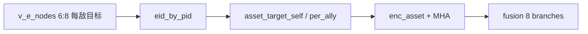

# MARL 注释扩展与重要设施目标观测

## 1. 新增观测语义与数据来源

与 `[marl/obs_generator.py](marl/obs_generator.py)` 中已有逻辑一致：敌方节点 `v_e_nodes[eid, 6:8]` 即为该敌机推断的攻击目标平面坐标（与 `_build_e_nodes` / `inferred_targets` 一致，对应地图 `ValuePos` 上的目标）。

| 张量名（建议）                 | 形状          | 含义                                    |
| ----------------------- | ----------- | ------------------------------------- |
| `asset_target_self`     | `[P, 1, 2]` | **己方负责的敌方**所攻击的**重要设施**（单目标，平面 x,y）   |
| `asset_target_per_ally` | `[P, A, 2]` | 与 `allies_local` 槽对齐：该槽友机所负责敌方对应的攻击目标 |

掩码：与分配一致即可——`asset_target_self` 与 `enemy_self_mask` 同步；`asset_target_per_ally` 与 `ally_enemy_mask`（或 `ally_mask`，与友机/敌分配同时有效时一致）同步，无效槽置 0。

实现位置：在 `_build_model_aligned_obs` 中，在已计算 `eid_by_pid`、友机槽位 `j` 的循环内，用 `v_e_nodes[eid, 6:8]` 填 `asset_target_self[pid]` 与 `asset_target_per_ally[pid, slot]`，避免重复计算推断目标。

## 2. 环境 `observation_space`

在 `[marl/MARL_env.py](marl/MARL_env.py)` 的 `_build_spaces` 中增加上述两键的 `spaces.Box`（与现有 `enemy_self_mask` / `ally_enemy_mask` 形状对齐）。

## 3. 网络改动（`[marl/models.py](marl/models.py)`）

- 将 `N_BRANCHES` 从 **6 调整为 8**（在融合维、critic 拼接维、懒加载 `_critic_net` 输入维上一致更新）。
- 新增 `**enc_asset`**：输入 2 维，输出 `hidden_dim`（与旧 `enc_target` 语义类似，专用于设施目标）。
- 新增 `**mha_asset_self`**、`**mha_asset_per_ally**`：`e_self` 为 query，与现有 enemy 分支并行。
- **Design A**：`concat_feat` 在原有六段后追加 `h_asset_self_sq`、`h_asset_ally_sq`（各 `[B,H]`）。
- **Design B**：增加 `gate_asset_self`、`gate_asset_ally`，`scores` 从 5 维扩为 **7** 维，加权项与 `alphas` 索引同步扩展。
- **Design C**：`concat_pts_feat` 在点级拼接中增加对 `asset_target_self` / `asset_target_per_ally` 的 MHA 输出（与 `h_eself`/`h_eally` 相同模式）。
- `**_encode_obs` / `_branch_tensors_ab` / `critic_forward`**：统一改为 8 路分支；更新类文档字符串与 critic 注释中的「六路」为「八路」。

## 4. 训练张量组装

在 `[marl/train_online0325.py](marl/train_online0325.py)` 的 `_build_model_obs` 中注册新键：`asset_target_self`、`asset_target_per_ally`，以及布尔掩码（若与现有 mask 完全复用，可仅文档说明「与 enemy_self_mask / ally_enemy_mask 共用」；若单独暴露更清晰，可增加 `asset_self_mask` / `asset_ally_mask` 与现有一致，避免重复逻辑——**推荐直接复用 `enemy_self_mask` 与 `ally_enemy_mask`**，减少键膨胀）。

## 5. 注释范围与风格（「所有 MARL 相关函数」）

在以下文件中，为**公开 API、环境步进、观测构建、奖励、训练入口、MAPPO 辅助**补充**模块级 docstring + 关键函数/方法 docstring**（中文为主，说明输入输出、与 `pairs_realE2P`/决策步语义的关系；避免对每一行 obvious 代码堆注释）：

| 文件                                                     | 重点                                                                                                   |
| ------------------------------------------------------ | ---------------------------------------------------------------------------------------------------- |
| `[marl/MARL_env.py](marl/MARL_env.py)`                 | `TODCMARLEnv` 类、`reset`/`step`、`_build_obs`、`_normalize_action`、`_compute_rewards`、`_sync_dynamic_k` |
| `[marl/obs_generator.py](marl/obs_generator.py)`       | `TODCObservationGenerator`、`generate`、`_build_model_aligned_obs`、`_build_c_nodes`                    |
| `[marl/models.py](marl/models.py)`                     | `build_actor_critic_schemes`、`TODCHeteroActorCritic`、`UAVInterceptionNetwork` 各分支与 MAPPO critic      |
| `[marl/rewards.py](marl/rewards.py)`                   | `RewardConfig`、`TODCRewardFunction` 的 `compute_step_rewards` / `apply_terminal_rewards`              |
| `[marl/train_online0325.py](marl/train_online0325.py)` | `TrainConfig`、`_todc_marl_env_dict`、`_build_model_obs`、`train_online`、`_run_eval_episode`            |
| `[marl/mappo.py](marl/mappo.py)`                       | `compute_gae`、`ppo_minibatch_update`                                                                 |

风格：与仓库现有写法一致——**简短英文**用于通用工具函数名说明，**中文**用于任务域（拦截、重规划、分配、掩码、MAPPO）。

## 6. 测试与文档

- 更新 `[tests/test_phase3_models.py](tests/test_phase3_models.py)` 中 `_fake_obs`，加入 `asset_target_self`、`asset_target_per_ally` 及掩码字段。
- 更新 `[tests/test_phase2_obs_generator.py](tests/test_phase2_obs_generator.py)` 中断言新键形状（若暴露）。
- 可选：在 `[docs/MARL_OVERVIEW.md](docs/MARL_OVERVIEW.md)` 观测表增加一行「设施目标」说明（与主计划同步即可）。

## 7. 数据流示意

## 8. 实施顺序建议

先实现观测与张量正确性，再改模型维度与 gate 数量，最后批量补注释并跑 `pytest`（`conda activate dubins`）。