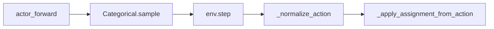

# 模型输出与环境动作接口核对

## 数据流（当前实现）

- 训练脚本 `[marl/train_online0325.py](marl/train_online0325.py)` 将 `actions.detach().cpu().numpy()` 传入 `env.step`（约 336、499 行），形状为 `**(num_P,)` 的 int64 向量**，与 `Categorical.sample()` 一致。

## `action_dict` 已是索引时，`_normalize_action` 在做什么？

实现见 `[marl/MARL_env.py](marl/MARL_env.py)` 约 914–968 行。

对 **一维数组且 `shape[0] == num_P`** 的分支（训练默认情况）：

- 直接 `idx = arr.astype(np.int64)`，**没有**再把索引转成别的语义。
- 仍会依次做三件事（因此不能简单删掉整段逻辑）：
  1. `**_build_obs()` + `_sync_dynamic_k(obs)`**：与当前步候选数 `K` 对齐（`[_sync_dynamic_k](marl/MARL_env.py)` 约 144–148 行）；动态 `K` 时 Gym 空间会更新。
  2. `**obs_at_action` 快照**：同一函数返回的 `obs` 用作 `_compute_rewards(..., obs_at_action=...)`（约 442–443、970–982 行）。注释已说明：内层仿真可能重规划、**候选数会变**，计奖必须把 `reward_nodes` / `self_pts_mask` / `self_pts` **固定为选动作时**的那版 mask。
  3. **校验并构造 `norm`（one-hot）**：对每个 `pid` 要求 `mask[pid, idx]>0`，否则 `ValueError`；`norm` 供 `TODCRewardFunction.compute_step_rewards` 使用（与 `[marl/rewards.py](marl/rewards.py)` 中基于 mask 的逻辑一致）。

另外保留的「复杂」分支是为了 **同一接口兼容**：长度为 `k_curr` 的向量（共享 logits/概率）、`(num_P, k_curr)` 矩阵、或逐智能体 dict 里长度为 `k` 的向量（按 mask 取 argmax）。若你**确定**永远只传 `(num_P,)` 索引，可讨论缩小 API，但 **快照 + 校验 + one-hot** 仍需要保留等价逻辑。

## 与 `_apply_assignment_from_action` 的一致性

`[_apply_assignment_from_action](marl/MARL_env.py)`（约 794–825 行）只对 `**pairs_realE2P` 中出现的 (eid, pid)** 从 `ICFinalActionCandidates` 取子集；索引 `action_indices[pid]` 必须落在 **该子集行数 `n`** 内，且与观测 mask 一致，否则 `IndexError` / `ValueError`。

观测里候选槽位与 `ICFinalActionCandidates` 子集顺序的对应关系由 `[marl/obs_generator.py](marl/obs_generator.py)` 的 `_build_c_nodes`（约 372–458 行）保证：对每个 `pid` 按 `ic_candidates` 中筛选出的行 **按原始顺序** 填入 `0..n-1` 槽位。

## 无候选或「死」机位时：模型输出与环境行为

此处「死」与测试 `[tests/test_obs_alive_masks.py](tests/test_obs_alive_masks.py)` 一致：**不在 `pairs_realE2P` 中的 pursuer**（或无配对）→ `_build_c_nodes` 不填该行 → `**self_pts_mask[pid]` 全为 False**。

| 环节                                                     | 行为                                                                                                                                                                                    |
| ------------------------------------------------------ | ------------------------------------------------------------------------------------------------------------------------------------------------------------------------------------- |
| **策略头** `[marl/models.py](marl/models.py)` 约 334–336 行 | `masked_fill(~self_pts_mask, -1e9)` 后 `softmax`。若某行 **全部** 被 mask，则 logits 全为 `-1e9`，`exp` 全为 0，`softmax` 易出现 **NaN**（0/0）；`argmax` 可能为 0；`Categorical(probs=...)` 在 NaN 时可能报错或采样无定义。 |
| **环境 `_normalize_action`**                             | 对每个 `pid` 要求至少一个合法槽位；`self_pts_mask` 全零则 `**ValueError: no valid action candidates for pursuer i**`（约 961–963 行）。                                                                     |
| `**pairs_realE2P` 为空**                                 | `_apply_assignment_from_action` 提前 return（约 802–803 行），但 `**_normalize_action` 已先执行**，仍会因全零 mask 而抛错。                                                                                 |

**结论**：当前设计假设 **每次调用 `step` 时，每个全局 `p_0..p_{P-1}` 在观测里至少有一个有效候选**。若存在「已无敌机可追但仍未 `done`」的 pursuer，或部分捕获后 `pairs_realE2P` 缩小导致某些 pid 不再出现在分配里，则 **存在与上述假设冲突、可能触发 `ValueError` 的路径**（值得单独开任务：对无动作智能体跳过校验 / 占位动作 / 或 episode 提前终止）。

## 可选后续（需你确认是否要做）

- 仅在需要时收紧训练侧类型（始终 `(num_P,)`），或文档化 dict / logits 用法。
- 为「全 mask 行」在模型里做数值稳定处理（例如仅对有效行算 softmax，无效行输出占位动作且 loss mask）。
- 环境侧对无候选 pid 定义明确语义（忽略动作 + 零奖励 / 或断言不再 `step`）。

