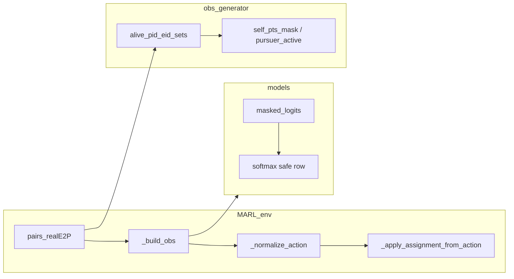

# 拦截完成后观测/模型输入与 -1 动作约定

## 问题域与索引约定（本次补充）

- **任务结构**：一对一拦截，且 **P 与 E 数量相同**，任意时刻在存活子集上仍为 **一一配对**（无一对多）。实现与验证可依赖该不变量简化分支（例如 `pairs_realE2P` 行数等于存活对数）。
- `**_pairs_ic_compact`**：与 `pairs_realE2P` **逐行对齐**，列对应 IC 表第 11–12 列的 **紧凑 ide/idp**（表内索引），**不是**全局 `eid`/`pid`。过滤 `IC_candidates`、子集 `eidMask & pidMask` 时必须始终用紧凑键；全局配对仅用于 `num_p`/`num_e` 槽位与 `alive_pid_eid_sets`。`[MARL_env._apply_hungarian_and_paths](marl/MARL_env.py)` 中在写 `pairs_realE2P` 时把紧凑行映射到全局 `(UnCapEid, UnCapPid)`，与 `[obs_generator._build_c_nodes](marl/obs_generator.py)` 的 `pairs_ic_ref` 用法一致。
- **屏蔽语义（必须满足）**：
  - **已拦截的我方**：该全局 `pid` 在观测与模型输入侧 **所有通道** 等价于「不存在」：全零张量 + 相关 mask 全 False，且动作约定为 **-1 / 不参与**（含 `self_uav`、`self_pts`、`allies_local`、`ally_pts`、分配敌与资产分支等，并检查 critic 聚合是否需按 `pursuer_active` 排除）。
  - **已拦截的敌方**：该全局 `eid` 对 **任意仍在工作的我方** 均不可见：不仅 `enemies`/`targets` 列置零与 `enemy_mask`/`target_mask` False，还须确认 **不会**通过友机槽的 `enemy_assigned_per_ally`、`asset_target_per_ally`、`ally_enemy_mask` 等路径泄漏（逻辑上应仅来自 `alive_eids` 与仍存活 `pairs`）。

## 现状（代码已做对的部分）

- **存活集合**：`[alive_pid_eid_sets](marl/obs_generator.py)` 由 `pairs_realE2P`（全局 eid/pid）推导；`[TODCMARLEnv._phase_update](marl/MARL_env.py)` 在 `pairs_realE2P.shape[0] == Capflag.shape[0]` 时用 `~Capflag` 同步缩小 `pairs_realE2P` / `_pairs_ic_compact`，使已完成的一对从分配表中消失（紧凑表与全局表同步删行）。
- **观测侧掩码**：`[TODCObservationGenerator._build_model_aligned_obs](marl/obs_generator.py)` 对无配对 `pid` 跳过友机/分配敌填充；`[_zero_dead_pursuers](marl/obs_generator.py)` / `[_zero_dead_evaders](marl/obs_generator.py)` 将对应 `self_uav`、`self_pts`、`self_pts_mask`、`enemies`/`enemy_mask` 等置零或 False；`[_build_c_nodes](marl/obs_generator.py)` 对无 `pid_to_subset` 的追捕者保持候选 mask 全 False。
- **网络侧**：`[UAVInterceptionNetwork.actor_forward](marl/models.py)` 使用 `self_pts_mask` 做 `masked_fill`；`[_apply_mha](marl/models.py)` 对「全 padding」键有 `all_masked` 分支，避免注意力完全失效。

## 缺口（与「一对一完成后仍跑多机 step」冲突）

1. **动作归一化必崩**：`[TODCMARLEnv._normalize_action](marl/MARL_env.py)` 在 `self_pts_mask` 某行全 False 时仍要求存在合法候选，否则 `raise`（约 971–974 行）。已完成拦截的全局 `pid` 正是这种情况。
2. **奖励同构问题**：`[TODCRewardFunction.compute_step_rewards](marl/rewards.py)` 同样对全零 mask 行 `raise`（约 101–104 行）。
3. **Softmax 数值**：`[actor_forward](marl/models.py)` 中 `masked_logits = logits.masked_fill(~self_pts_mask, -1e9)` 后若某行 **全部为 False**，则该行全为 `-inf` 量级，`softmax` 易出现 **NaN**（与训练采样 `Categorical` 不兼容）。
4. **位置张量泄漏（与「敌机不出现在他机观测」相关）**：`[_positions_full_for_obs](marl/MARL_env.py)` 将紧凑状态 scatter 到全局槽位后，**已完成拦截**的全局 `pid`/`eid` 仍可能保留末帧几何；`[_build_p_nodes](marl/obs_generator.py)` / `[_build_e_nodes](marl/obs_generator.py)` 会先读到该几何，再在后续步骤对部分输出清零。为严格满足「已拦截敌机不进入他机观测中间量」，应在 scatter **之后**对「非 `UnCapPidNew` / 非 `UnCapEidNew`」的全局槽位置零（与文件中 TODO 一致），使 `v_e_nodes` 等中间量中已死 `eid` 不携带可区分信号。

## 推荐实现方案（与「全 mask + 输出 -1」对齐）

### 1. 观测：显式 `pursuer_active`（或等价名）

- 在 `[TODCObservationGenerator.generate](marl/obs_generator.py)` / `_build_model_aligned_obs` 返回 dict 中增加 `**pursuer_active`: shape `(num_p,)`，bool 或 int8**，语义建议：`active[pid] = self_pts_mask[pid].any()`（与「是否仍有候选/仍参与决策」一致）。
- 在 `[TODCMARLEnv._build_spaces](marl/MARL_env.py)` 的 `observation_space` 中注册该键。
- 在 `[train_online0325._build_model_obs](marl/train_online0325.py)` 的 `required_keys` 中加入该键并 `to_tensor`（若 critic/actor 暂不使用，也需传入以便后续 PPO 等按机 mask 损失）。

### 2. 模型：`self_pts_mask` 全 False 行的 logits / probs

- 在 `[UAVInterceptionNetwork.actor_forward](marl/models.py)` 的 `masked_fill` 之后：
  - 对 `~self_pts_mask.any(dim=-1)` 的行，将 `**masked_logits` 置为安全值**（例如该行全 0），并令 `**probs` 第一维为 1、其余为 0**（或单独 `inactive_probs`），保证 **无 NaN**。
  - 同时输出 `**best_candidate_idx` 为 -1**（tensor 用 `-1` 整型）表示无效机，与用户需求一致。
- 若训练脚本用 `Categorical(probs)`：对 inactive 行需在 `[train_online0325.py](marl/train_online0325.py)`（及 roll/trace 路径）**跳过 `log_prob` / 或 `log_prob * active.float()`**，并在 `env.step` 前将 **inactive 机动作强制为 -1**（避免把「伪 argmax 0」当真动作）。

### 3. 环境：接受 `action == -1` 且跳过校验

- `[_normalize_action](marl/MARL_env.py)`：若 `~mask[i].any()` 或显式 `pursuer_active[i]==False`，则 `**idx[i] = -1`**，**不参与**后续的「必须存在合法候选」校验与 one-hot 写入（或 one-hot 保持全 0）。
- `[_apply_assignment_from_action](marl/MARL_env.py)`：已只遍历 `pairs_realE2P` 中的 `(eid,pid)`；确认 `**action_indices[pid]` 在 pid 仍在 pairs 时仍合法**；对已从 pairs 移除的 pid **不读取**动作即可（当前结构已满足，只需保证 `_normalize_action` 不再对这类 pid 报错）。
- **文档/注释**：约定 **numpy 动作 -1 = 该机本步不参与**；`MultiDiscrete` 若不能表达 -1，可在 env wrapper 或训练侧把「最后一个离散值」映射为 -1（二选一，建议优先 **训练侧直接传 -1 的 ndarray** 与当前 `step` 接口一致）。

### 4. 奖励：inactive 机零奖励、不读候选

- `[TODCRewardFunction.compute_step_rewards](marl/rewards.py)`：当 `mask[i]` 全零（或 `pursuer_active[i]` 为假）时，**跳过**该 `i` 的候选索引校验与 `r_qual`/`r_global` 等基于 `selected` 的项，**保持 0**；全局项（如分散）若不应计入死机，可按 `pursuer_active` 过滤参与 `sel_xy` 的索引集合。

### 5. 收紧 `_positions_full_for_obs`（建议纳入必做，与屏蔽语义一致）

- 在 scatter 得到 `out_p`/`out_e` 后，对 **不在** `UnCapPidNew` / `UnCapEidNew` 中的全局槽位将 `pos_p_obs`/`pos_e_obs` **置零**（一对一、数量相同下即「已拦截对」），再进入 `obs_generator`。这样已拦截敌方不会以坐标形式进入 `v_e_nodes` 供他机编码；已拦截我方同理。
- 实现时注意：`UnCap`* 为 **全局 id** 列表，与 `_pairs_ic_compact` 的紧凑索引分工明确，避免混用。

### 6. 观测路径审计（与第 3 条屏蔽语义对齐）

- 通读 `[_build_model_aligned_obs](marl/obs_generator.py)` 中友机槽、`*_assigned_`*、`enemies`/`targets` 的填充条件，确认 **仅** `alive_pids` / `alive_eids` 与当前 `pairs_realE2P` 一致；若发现任一路径在 `eid` 已退出 `alive_eids` 后仍写入非零特征，在该路径加断言或修正。

## 验证建议

- 构造 `**num_P == num_E`、一对一** 场景：先使其中一对捕获成功但 `**done_all` 仍为 False**（尚有其他存活对），再调用 `env.step`：**不应再出现** `no valid action candidates` / reward 同类异常。
- **屏蔽断言**：在单步观测上，任选存活 `pid_a`，断言对所有已退出 `alive_eids` 的 `eid_dead`：`enemy_mask[pid_a, eid_dead]` 为假且 `enemies[pid_a, eid_dead]` 为零向量；对已完成 `pid_dead`：`self_pts_mask[pid_dead]` 全假且 `pursuer_active[pid_dead]` 为假（待实现键）。
- 单步前向：对人为构造「`self_pts_mask` 全 False」的 batch，检查 `**action_probs` 无 NaN**，`best_candidate_idx` inactive 行为 -1。
- 回归：全存活若干步与原有训练脚本一步，确认 logits 形状与 `wandb` 标量无异常。

