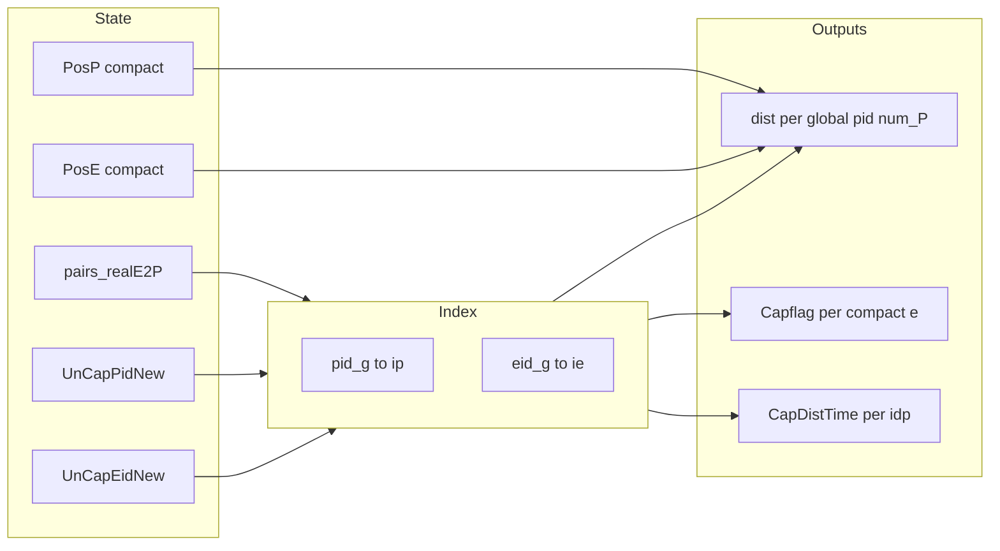

# 按 `pairs_realE2P` 修正拦截对距离与相关几何

## 问题定位

当前 `[_pairwise_dist](marl/MARL_env.py)` 实现为：

```840:843:marl/MARL_env.py
    def _pairwise_dist(self):
        pp = self.PosP[:, :2]
        ee = self.PosE[:, :2]
        return np.linalg.norm(pp[:, None, :] - ee[None, :, :], axis=2)
```

在 `PosP`/`PosE` 为**紧凑行**（与 `UnCapPidNew`/`UnCapEidNew` 顺序一致）时，矩阵下标 `(i,j)` 表示「第 `i` 个存活追捕者 vs 第 `j` 个存活敌机」，**不是**全局 `(pid, eid)` 的语义；对「一对一任务分配」应只关心 `**pairs_realE2P` 中每一行 `(eid_g, pid_g)`** 对应的距离。

`[_update_capflag_from_geometry](marl/MARL_env.py)` 中还存在逻辑断裂：

- 距离用 `np.min(distances_now, axis=0)`（按列：每个敌机对所有追捕者取最近）。
- 角度却用 `p_for_e_now = self.PosP` 与 `e_now = self.PosE` **逐行对齐**，等价于假定紧凑第 `i` 行 P 与第 `i` 行 E 是一对，与「最近邻」距离不一致。

`[_compute_rewards](marl/MARL_env.py)` 与 `[reset](marl/MARL_env.py)` 中 `curr_min_dist = self._pairwise_dist().min(axis=1)` 得到长度为 `**nP_compact`** 的向量，而 `[TODCRewardFunction.compute_step_rewards](marl/rewards.py)` 按 `**num_p`（全局 P 数）** 索引 `delta[i]`，在部分捕获后存在**长度/语义**错误。

`[_compute_isomap_intercept_candidates](marl/MARL_env.py)` 第 597 行 `distances = np.min(self._pairwise_dist(), axis=1)` 将 `cap_dist_time`/`cap_angle_time` 按**紧凑 pursuer 下标 `idp`** 建表；更合理的是对每个 `idp` 使用其**当前分配敌机** `(eid_g, pid_g)` 对应的 `D[idp, ie]`，与后续 Hungarian/RL 任务一致；在 `**pairs_realE2P` 仍为 `None`** 的首次规划前可保留现有 `min(axis=1)` 作为回退。

## 推荐实现

### 1. 小型索引工具（`[MARL_env.py](marl/MARL_env.py)`）

- 由 `UnCapPidNew` / `UnCapEidNew` 构建 `**pid_g -> 紧凑行 ip**`、`**eid_g -> 紧凑行 ie**` 的字典或 `np.full(num_P, -1)` / `np.full(num_E, -1)` 数组（查不到则视为无紧凑几何，配合现有「不符合预期可报错」风格）。
- 由 `pairs_realE2P` 构建 `**pid_g -> eid_g**`（一对一假设下每 `pid` 至多一行；若多行则直接 `raise`）。

### 2. 分配对距离 API（替换/补充 `_pairwise_dist` 用法）

- `**_assigned_pair_distance_matrix_compact**`（或保留 `_pairwise_dist` 名仅作全矩阵、另增新名）：仍可用一次 `np.linalg.norm(pp[:,None]-ee[None,:],axis=2)`，但对外暴露：
  - `**_dist_for_assigned_pairs_vector()**`：长度 `num_P` 的 `float64`（或 `float32`）：`result[pid_g] = ||PosP[ip]-PosE[ie]||` 若 `(eid,pid)` 在 `pairs` 且两行存在；无配对 pid 填 `0.0` 或 `np.inf`（与奖励里 inactive 分支一致，建议 **无任务 0.0**，避免 `delta` 异常）。
- 若仍需全矩阵（测试/调试），保留原 `_pairwise_dist` 实现或改名为 `_pairwise_dist_compact_all_pairs`，避免误用。

### 3. `[_update_capflag_from_geometry](marl/MARL_env.py)`

- 对每个**紧凑敌机行** `ie`（`eid_g = UnCapEidNew[ie]`），从 `pairs` 取唯一 `pid_g`，再取 `ip`，计算：
  - `d = ||PosE[ie,:2]-PosP[ip,:2]||`
  - 朝向差：用 `**PosP[ip]`** 与向量 `**PosE[ie]-PosP[ip]**`（与分配追捕者一致）。
- 将 `Capflag[ie]` 设为距离与角条件；**不再**使用 `np.min(..., axis=0)` + 错误逐行 `PosP`。

### 4. `[_compute_isomap_intercept_candidates](marl/MARL_env.py)` 第 597–614 行

- 若 `self.pairs_realE2P is not None` 且行数与当前存活一致：对每个紧凑 `idp in [0, num_P_)`，令 `pid_g = UnCapPidNew[idp]`，取分配 `eid_g`，再取 `ie`，`**distances[idp] = D[idp, ie]`**。
- 若 `pairs_realE2P is None`（例如首次重规划前）：保留 `**np.min(D, axis=1)**`。

### 5. `[reset](marl/MARL_env.py)` 与 `[_compute_rewards](marl/MARL_env.py)`

- 将 `self.last_min_dist` 与 `curr_min_dist` 改为 `**shape (num_P,)**` 的**全局 per-pid** 分配距离（无任务 pid 为 0），与 `[marl/rewards.py](marl/rewards.py)` 中 `delta[i]` 一致。

### 6. 测试与回归

- 在 `[tests/test_marl_post_capture.py](tests/test_marl_post_capture.py)` 或新建测试中：构造已知 `pairs_realE2P` 与人工 `PosP`/`PosE`，断言**分配对距离**不等于错误的全矩阵 min（可构造「最近邻不是分配机」的几何）。
- 断言 `last_min_dist.shape == (env.num_P,)`。




