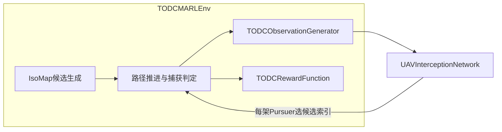

# Dubins_Intercept：MARL 视角解读与潜在问题

## 1. 项目在 MARL 里「解决什么问题」

- **任务**：多架 Pursuer 在障碍地图中拦截多架 Evader；底层是 Dubins / IsoMap 与任务分配等**传统规划管线**（与 `main/main0319forRL.py` 同源思路）。
- **RL 扮演的角色**：不输出连续 `(v, ω)`，而是在每次**重规划**得到的离散**拦截候选点/方案**中为每个 Pursuer **选一个索引**（pointer / scoring）。
- **时间语义**：一次 `env.step` = 一次「在线决策步」：先应用动作，再内层循环推进仿真直到**需要重规划**、**终止**或**截断**（见 [`../marl/MARL_env.py`](../marl/MARL_env.py) 中 `step` 与注释）。

## 2. 智能体、参数共享与「是否 CTDE」

- **智能体**：`num_P` 个 Pursuer；Evader 由轨迹与规则驱动，不是可学习对手。
- **实现方式**：**单网络、批维 = P**——训练里把 `obs` 堆成 `[P, ...]`，一次 `model.forward` 得到每架机的 `action_probs` 与 `value`（见 [`../marl/train_online0325.py`](../marl/train_online0325.py) `_build_model_obs` + 主循环）。
- **观测是 ego-centric**：每行是「我以自己为参考」的盟友、候选点、敌机等（[`../marl/obs_generator.py`](../marl/obs_generator.py)）。
- **Critic（MAPPO）**：集中式，输入为各智能体融合前八路分支特征拼接后的 **联合向量**，输出每机一个 `V_i`（[`../marl/models.py`](../marl/models.py) `critic_forward`）。

## 3. 输入 / 输出（接口层面）

| 环节 | 内容 |
|------|------|
| **观测** | `Dict`：`self_uav`, `allies_local`, `enemy_assigned_self`, `enemy_assigned_per_ally`, `self_pts`, `ally_pts`、`asset_target_self`、`asset_target_per_ally` 及 `ally_mask`, `enemy_self_mask`, `ally_enemy_mask` 等；另含 `enemies`, `targets`, `reward_nodes`, `assets`（计奖/资产） |
| **训练用张量** | [`train_online0325._build_model_obs`](../marl/train_online0325.py) 转模型 `forward` 所需键（含设施目标坐标）；**不**把 `assets` / `reward_nodes` 喂给网络 |
| **动作** | 训练传入形状 `(num_P,)` 的 **int 索引**；环境 `_normalize_action` 也支持 dict `p_i` 或概率矩阵（[`../marl/MARL_env.py`](../marl/MARL_env.py)） |
| **奖励 / 终止** | `rewards["p_i"]`；`terminations["__all__"]` / `truncations["__all__"]` 对所有智能体相同（全队同时 done/trunc） |

## 4. 模型（[`../marl/models.py`](../marl/models.py)）

- **三种结构**：A 拼接融合 + pointer；B 门控融合 + pointer；C 逐候选点打分（无点间 self-attention）。
- **动作维**：logits 维数 = 当前步候选数 **K**（张量第二维 `M`），与 `self_pts_mask` 联合做 softmax；**K 随重规划变化**，由 `_sync_dynamic_k` 更新 `k_max` 与 `gym` 空间（[`../marl/MARL_env.py`](../marl/MARL_env.py)）。
- **编码器**：`self_pts` / `ally_pts` 为 **8 维** MLP；与观测里 8 维特征一致。

## 5. 训练算法（[`../marl/train_online0325.py`](../marl/train_online0325.py)）

- **MAPPO**：每回合整条 trajectory 存 rollout，**GAE(λ)** 估计优势，**PPO clip** 更新策略；超参见 YAML `ppo_clip`, `ppo_epochs`, `gae_lambda`, `ppo_minibatch_size`。
- **多 scheme**：同一配置下为 A/B/C **各建一个 env + 模型 + 优化器**，并行跑 episode（非参数共享跨结构）。

## 6. 从 MARL / 工程角度值得关注的问题

### 6.1 观测与模型不一致 / 信息遗漏

- 环境 `observation_space` 含 **`assets` / `asset_mask`**，但 **网络前向未使用** `assets`；已增加 **`asset_target_self` / `asset_target_per_ally`**（与 `v_e_nodes` 推断攻击目标一致）供策略编码。**静态**资产几何仍主要在 `assets` 中，若需显式几何对齐可再扩展输入。

### 6.2 配置与真实环境参数

- 训练脚本支持在 YAML / `--env-json` 中提供 **`env`** 字典，其键值会**合并进** `TODCMARLEnv` 的 `config`（可传 `map_root`、`collision_dist`、`cap_dist` 等）。与训练超参同级的字段仍由 `TrainConfig` 顶层的 `time_res`、`enable_dwa_replan` 等控制（见 [`../configs/train_online0324.yaml`](../configs/train_online0324.yaml)）。

### 6.3 动作与掩码（fail-fast）

- **环境** [`_normalize_action`](../marl/MARL_env.py) 与 **奖励** [`compute_step_rewards`](../marl/rewards.py) 对非法离散索引、全零掩码行、错误长度的权重向量等采用 **直接 `ValueError`**，便于调试；不会静默改写到首个合法候选。
- **计奖观测**：`step` 内一次决策可能触发重规划并改变候选数 K；[`_compute_rewards`](../marl/MARL_env.py) 对 **候选相关** 字段使用「选动作时刻」的观测快照，对 **机间距离等** 仍用当前几何，避免索引与 mask 错位。

### 6.4 奖励与信用分配

- **终端奖励**：捕获奖励按 `captured_delta / num_e` 缩放后**加到每个 `p_i`**；资产损失惩罚同样**全员相同**（[`../marl/rewards.py`](../marl/rewards.py) `apply_terminal_rewards`）。利于合作信号，但**个体贡献**模糊。
- **步级奖励**：含 `r_global`（分散、同目标惩罚）等，与 **离散选点** 的因果关系链较长，配合单步更新方差大。

### 6.5 MARL 非平稳与算法强度

- 多机同时学习 + 共享网络：**非平稳**仍可能存在；已采用 **MAPPO** 与集中 critic，仍可能需要熵与奖励尺度调参。

### 6.6 动态 K 与 Gym 严格检查

- `k_max` 随候选数变化会 **重建** `action_space` / `observation_space`。若使用依赖「固定空间」的库或严格 `check_env`，可能报错；自研训练循环则通常无妨。

### 6.7 依赖 `pairs_realE2P`

- [`obs_generator._build_c_nodes`](../marl/obs_generator.py) 迭代 `pairs_realE2P`；若在某一状态下为 `None` 会与类型标注不符且会运行期报错。正常流程在首次 replan 后由 `_apply_hungarian_and_paths` 赋值；自定义 reset/跳过规划时需格外小心。

### 6.8 文档与入口脚本

- 在线训练入口为 **`python -m marl.train_online0325`**（与默认配置文件注释一致）。

### 6.9 运行环境（`conda activate dubins`）

- YAML 默认 `device: cuda:0`：无 GPU 时需改 **cpu**，否则脚本会显式报错。
- 无显示服务器时建议 `export MPLBACKEND=Agg`，否则 `render` / W&B 截图可能失败。
- 地图与轨迹 **joblib** 资源必须齐全；缺失会直接 `FileNotFoundError`。

---

## 7. 小结

该项目是 **「传统几何规划产生候选 + MARL 离散决策」** 的混合系统：MARL 接口上是多智能体 dict 奖励与全队同步终止，实现上是 **参数共享的单策略网络批处理**。主要风险集中在 **观测中未进入网络的字段**、**训练算法偏简单（非 PPO/MAPPO）** 以及 **奖励的全局/终端分配较粗**。

若你后续希望「只改某一块」：优先明确是要动 **候选生成**、**观测字段**、**奖励尺度** 还是 **训练目标（GAE/PPO/多步）**，再针对性改对应文件即可。
